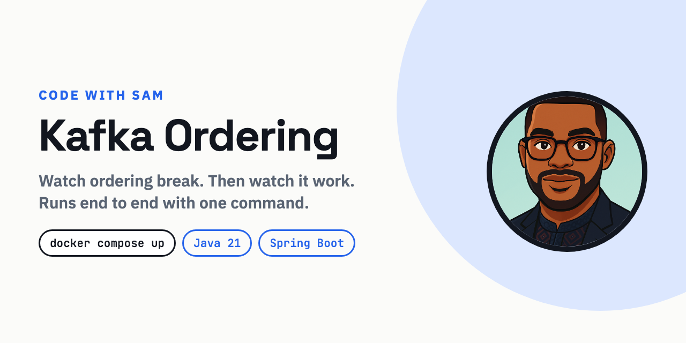
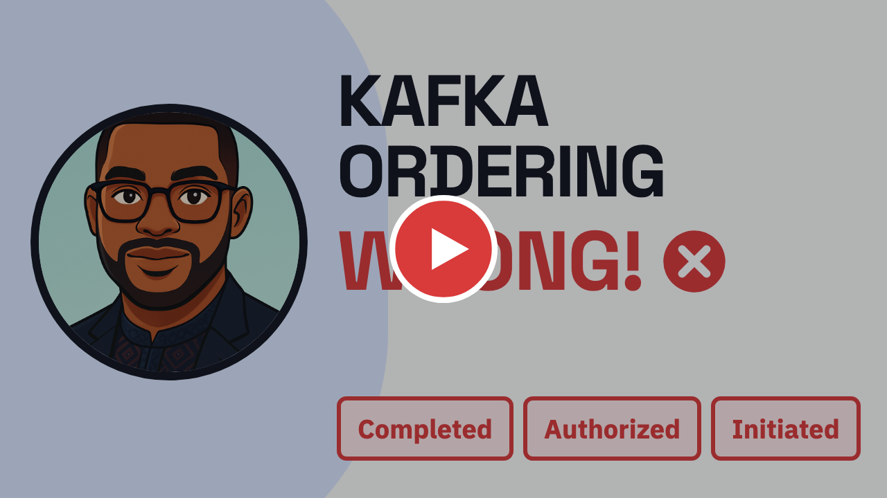

<p>
  <a href="https://github.com/code-with-sam-dev/kafka-payments/actions/workflows/ci.yml">
    
  </a>
  
  
  
  
  <a href="https://www.youtube.com/@CodeWithSam">
    
  </a>
</p>

> **Episode 1 of [Kafka Payments](../README.md)** — a payments service built one
> concept per episode. This stage introduces partitions, message keys, and the
> way consumer concurrency destroys ordering Kafka delivered correctly.
> Next stage: sequencing in progress.

# Kafka Ordering Demo

Kafka guarantees ordering — but only **within a partition**. And even then, your
own consumer can throw that guarantee away.

This repository lets you watch both happen on your machine, in about a minute.

## Watch the explanation

<a href="https://www.youtube.com/watch?v=REPLACE_WITH_VIDEO_ID">
  
</a>

**[Kafka Ordering Explained: The Mistake That Breaks Your System →](https://www.youtube.com/watch?v=REPLACE_WITH_VIDEO_ID)**
· 4 minutes · [Code with Sam](https://www.youtube.com/@CodeWithSam)
· [Read the article](https://code-with-sam-dev.github.io/codewithsam-site/blog/kafka-ordering-explained)

---

## Run it

You need Docker. Nothing else — no Java, no Kafka, no Maven on your machine.

```bash
git clone https://github.com/code-with-sam-dev/kafka-payments
cd kafka-payments/episode-01-ordering
docker compose up --build
```

Kafka starts in KRaft mode (no ZooKeeper), the app waits for it to be healthy,
then exposes a small REST API on `localhost:8080`.

### Produce some payments

```bash
curl -X POST "http://localhost:8080/demo/run?payments=3"
```

Three payments, three events each: `INITIATED`, `AUTHORIZED`, `COMPLETED`. All
produced in the correct order, all keyed by payment id.

### See what each consumer actually did

```bash
curl http://localhost:8080/demo/results
```

```json
{
  "broken":  { "ordered": false, "count": 9,
               "processedInThisOrder": ["payment-1 COMPLETED (#3)",
                                        "payment-1 INITIATED (#1)", "..."] },
  "correct": { "ordered": true,  "count": 9,
               "processedInThisOrder": ["payment-1 INITIATED (#1)",
                                        "payment-1 AUTHORIZED (#2)", "..."] }
}
```

Both consumers received **identical records in identical order** from Kafka.
One preserved it. One did not.

```bash
curl -X POST http://localhost:8080/demo/reset   # run it again
```

---

## What the two consumers do differently

`BrokenConsumer` polls the partition, gets the records in the right order, and
then hands each one to a thread pool "to go faster":

```java
@KafkaListener(topics = "payment-events", groupId = "broken-consumer")
public void consume(String raw) {
    pool.submit(() -> process(raw));   // ordering ends here
}
```

Nothing about that looks wrong. It passes review. It works under light load.
Then the pool runs them concurrently, they finish in whatever order they
finish, and your database has `COMPLETED` applied before `INITIATED`.

`CorrectConsumer` does less:

```java
@KafkaListener(topics = "payment-events", groupId = "correct-consumer")
public void consume(String raw) {
    process(raw);                      // on the listener thread, in sequence
}
```

That is not slower in any way that matters. Parallelism still exists — it lives
at the partition level, where Kafka intended it. Want more throughput? Add
partitions and consumers, not threads inside one consumer.

## Why the key matters

```java
kafkaTemplate.send("payment-events", paymentId, event);
//                                   ^^^^^^^^^ decides the partition
```

Kafka hashes the key to pick a partition, so every event for one payment lands
in the same ordered log. Different payments spread across partitions and
process in parallel.

You do **not** want global ordering. Global ordering means one partition, which
means one consumer, which means no scalability. You want ordering for the
business entity that needs it, and parallelism everywhere else.

## Producer settings that also protect ordering

In `application.yml`:

```yaml
acks: all
properties:
  enable.idempotence: true
```

Without idempotence, a retried batch can be written *after* a later batch that
succeeded — reordering records inside a partition before any consumer sees
them. Ordering lost on the producer side, and easy to miss.

## Tests

```bash
mvn test
```

Runs against an embedded broker, so no Docker and no network are needed. The
tests assert that the sequential consumer preserves per-key order, and that the
broken consumer still receives everything — because that is precisely why the
bug survives review. Counts reconcile, logs look healthy, and the state is
still wrong.

---

## The short version

- One **partition** is one ordered stream. One **topic** is not.
- Same **key** puts related events in the same partition.
- **Concurrency inside your consumer** destroys ordering Kafka delivered correctly.
- **Retries and DLQs** are an ordering decision, not just error handling.
- **Partition count** changes key routing. Choose it deliberately.

---

## More from Code with Sam

Modern software engineering interview preparation for the AI era — the
questions senior backend engineers are actually asked, with a video, an
article, and runnable code for each.

**[▶ Subscribe on YouTube](https://www.youtube.com/@CodeWithSam?sub_confirmation=1)**
· **[Read the articles](https://code-with-sam-dev.github.io/codewithsam-site)**

If this repo helped, a ⭐ makes it easier for the next person to find.

## Licence

MIT. Use it, fork it, take it into an interview.
